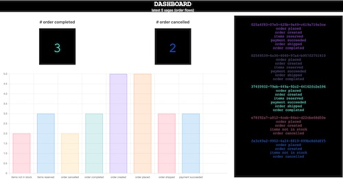

# Sagas

A simplified implementation (demo) of an order fulfilment flow as a choreographed [Saga](https://microservices.io/patterns/data/saga.html). 

### Purpose
Demo-environment for a workshop in event-driven architecture and the Saga pattern. 

## Prerequisites
Docker Desktop (with kubernetes enabled) and skaffold   
.NET 6    
Deno   
Go   

## Run
1. ``skaffold run`` and wait for the system to spin up  
...and when everything is up and running:
2. open browser at http://localhost (dashboard)  

3.  simulate an order flow 
every 10 seconds with: ```deno run -A sales-app-sim.ts```   


## Scenario  

**Architecture**  

```
          sales-app-sim 
                |
                |
              rabbit----------- monitoring------dashboard
                |
                |
                |
-------------------------------------------          
   |         |         |           |               
 order   warehouse   payment  notification
service   service    service    service 

```
The service are built in .NET 6 with Postgres and Go with MongoDB and the sales-app-sim is a simple Deno script. 

**There is a built-in delay for every step in the order flow. This is only for demo purposes (makes it easier to follow the flow in the dashboard)**

The RabbitMQ management UI is exposed on localhost:15672 (guest/guest)  

The databases are not exposed on localhost so you need to ``kubectl port-forward <podname> 5432:5432`` (for Postgres) or ``kubectl port-forward <podname> 27017:27017`` (for MongoDB) to access them locally (with DBeaver and mongosh or what ever tool you prefer).

**Order Fulfillment flow (as a choreographed saga)**

1. sales-app-sim emits an ``order.placed`` event
2. orderService creates an order and emits an ``order.created`` event  
3. warehouseService checks if the order is in stock and reserves the items and finally emits an ``order.items.reserved`` event or an ``order.items.notinstock`` event
4. paymentService takes money from the customer and emits an ``order.payment.completed`` event
5. warehouseService ships the order and emits an ``order.shipped`` event  
6. orderService completes the order and emits an ``order.completed`` event

(notification service communicates the order status to the customer for several steps(events) in this flow)


**Rollback example with compensating transactions**

For every order simulated there is a 50% risk of the items not being in stock. When this happens the warehouse service will emit an ``order.items.notinstock`` event. The order service will listen for this event and cancel the order and emit an ``order.cancelled`` event. Notification service listens for all events and informs the customers about important steps.

**Exercise**

Are there more rollback scenarios? How would we handle the payment failing? How would we handle the shipping failing?

